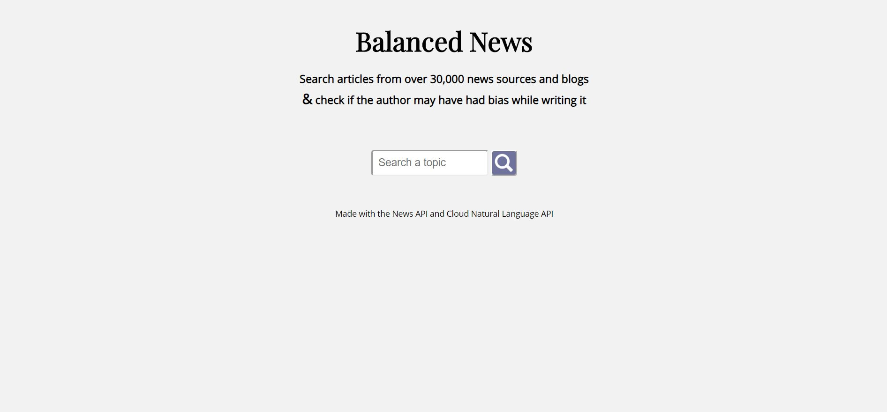
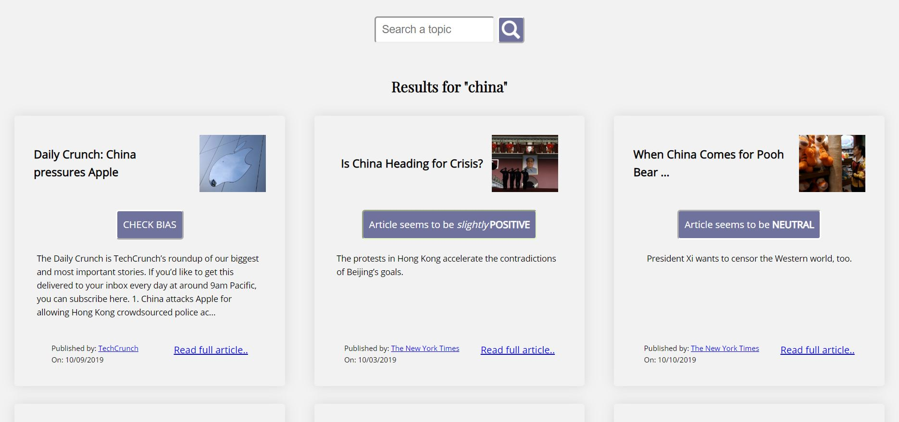

# Balanced News
A bias checking, news search app

## Reason
With the amount of news we consume on a daily basis, It is more important than ever to know if the authors had bias while writing the articles we read.
This app uses natural language processing to analyze the description and article preview, deciding if the article may be positive/negative/mixed/neutral.

## Screen-shots
Homepage Searchbar:

Search Results:

## How to
It's simple, after inputting a valid search query (it helps if it is under 3 words long, something like "Human Rights" or "Trade Agreement")
* Click the search button and the News API will populate the screen with results from over 30,000 news sources and blogs. You will see the title of the article, a link to the full article, and a button that says "CHECK BIAS".
* Click the "CHECK BIAS" button, the Cloud Natural Language API will analyze the text and tell you the suspected sentiment of the article as well as the strength of the sentiment.

## Built with
* HTML
* CSS
* JavaScript
* News API
* Cloud Natural Language API

## Live App
- [Use the App](https://mr-dojo.github.io/point-of-view/)
